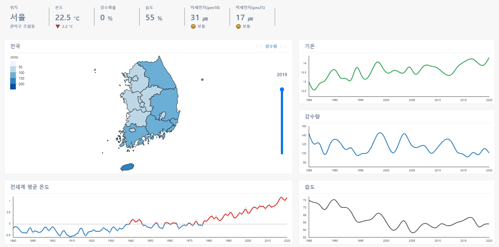

# Raccoon Weather

<a href="https://weather.dev-raccoon.site" target="_blank">Raccoon Weather 바로가기</a>

  

### Introduction

- 날씨 정보 수집 서버

### Features

- WIFI IP 주소를 이용해 사용자의 위치 판별
- 현재 및 과거 날씨 수집
- 배포 자동화
- Slack을 이용한 에러 알림

### Tech

- Typescript
- Express.js
- Mysql(sequelize)
- node-cron, cheerio
- Naver Geolocation API
- EC2, Travis, CodeDeploy, Docker
- Slack

### Open API Data

#### Current Weather

| 코드 | 설명         | 단위   |
| ---- | ------------ | ------ |
| T1H  | 기온         | ℃      |
| RN1  | 1시간 강수량 | mm     |
| REH  | 습도         | %      |
| PTY  | 강수형태     | 코드값 |

#### Short Forecast

| 코드 | 설명         | 단위   |
| ---- | ------------ | ------ |
| T1H  | 기온         | ℃      |
| RN1  | 1시간 강수량 | mm     |
| SKY  | 하늘상태     | 코드값 |
| REH  | 습도         | %      |
| PTY  | 강수형태     | 코드값 |
| LGT  | 낙뢰         | 코드값 |

#### Mid Forecast

| 코드 | 설명       | 단위   |
| ---- | ---------- | ------ |
| POP  | 강수확률   | %      |
| PTY  | 강수형태   | 코드값 |
| REH  | 습도       | %      |
| SKY  | 하늘상태   | 코드값 |
| T3H  | 3시간 기온 | ℃      |
| TMX  | 최고기온   | ℃      |
| TMN  | 최저기온   | ℃      |
