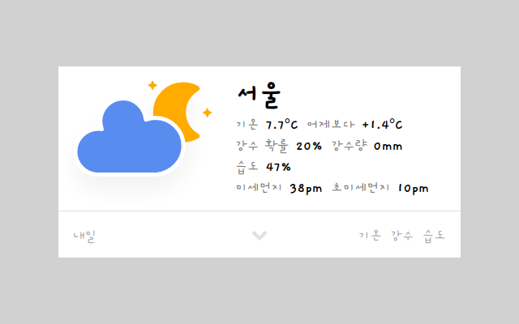
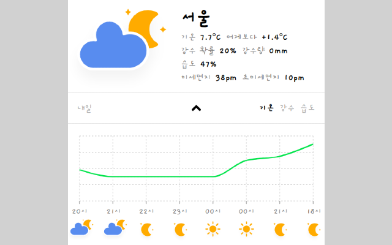
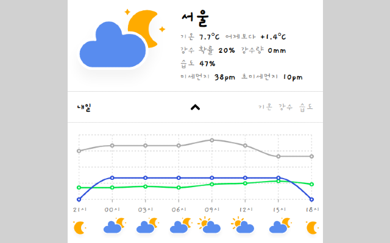

# Raccoon Weather

<a href="https://chrome.google.com/webstore/detail/raccoon-weather/lkjiceiccfaeddfhodmclmicchaagcno" target="_blank">크롬 웹 스토어 - Raccon Weather</a>

<a href="https://github.com/raccoon91/raccoon-weather-extension-v2" target="_blank">raccoon-weather-extension</a>

### Introduction

- Typescript, Express를 이용한 날씨 정보 크론 서버

<div style="display: flex;">
  
  
  
</div>

### Features

- WIFI IP 주소를 이용해 사용자의 위치 판별
- redis를 이용한 날씨, IP 데이터 캐싱
- 일정 시간마다 시, 도별 날씨 및 예보 저장
- 그래프를 이용한 시간대별 예보 정보

### Installation

```
git clone https://github.com/raccoon91/raccoon-weather-server.git

cd raccoon-weather-server

yarn install

yarn dev // localhost:3000
```

### Tech

#### Front

- Typescript
- React, Mobx
- recharts.js
- styled-components

#### Back

- Typescript
- Express.js
- AWS EC2
- Mysql(sequelize), Redis
- node-cron
- Naver Geolocation API

### Current Weather

| 코드 | 설명         | 단위   |
| ---- | ------------ | ------ |
| T1H  | 기온         | ℃      |
| RN1  | 1시간 강수량 | mm     |
| REH  | 습도         | %      |
| PTY  | 강수형태     | 코드값 |

### Short Forecast

| 코드 | 설명         | 단위   |
| ---- | ------------ | ------ |
| T1H  | 기온         | ℃      |
| RN1  | 1시간 강수량 | mm     |
| SKY  | 하늘상태     | 코드값 |
| REH  | 습도         | %      |
| PTY  | 강수형태     | 코드값 |
| LGT  | 낙뢰         | 코드값 |

### Mid Forecast

| 코드 | 설명       | 단위   |
| ---- | ---------- | ------ |
| POP  | 강수확률   | %      |
| PTY  | 강수형태   | 코드값 |
| REH  | 습도       | %      |
| SKY  | 하늘상태   | 코드값 |
| T3H  | 3시간 기온 | ℃      |
| TMX  | 최고기온   | ℃      |
| TMN  | 최저기온   | ℃      |
