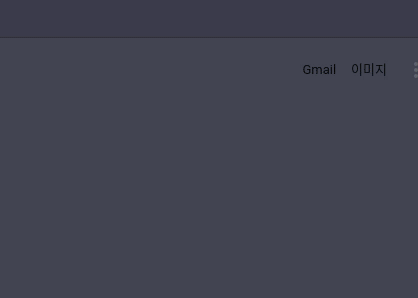

# Raccoon Weather

<a href="https://chrome.google.com/webstore/detail/raccoon-weather/ljgmcohabpgbcghaejceankdhceibdaf" target="_blank">Raccon Weather</a>

<a href="https://github.com/raccoon91/raccoon-weather-extension" target="_blank">raccoon-weather-extension</a>

### Introduction

- Vue.js를 이용한 Chrome Extension
- 사용자의 ip 주소를 이용해 위치를 판별하고 해당 시, 도의 날씨, 예보를 보여주는 크롬 익스텐션



### Features

- ip 주소를 이용해 사용자의 위치 판별 (모바일, 핫스팟 미지원)
- cookie를 이용한 위치 정보 저장
- 일정 시간마다 시, 도별 날씨 및 예보 저장
- 날씨 정보 캐싱
- 그래프를 이용한 시간대별 예보 정보
- 내일 날씨의 경우 tooltip을 이용한 세부 정보 제공

### Installation

```
git clone https://github.com/raccoon91/raccoon-weather-server.git

cd raccoon-weather-server

yarn install

npm run dev // port:3000
```

### Tech

#### Front

- Javascript(ES6+)
- Vue.js, vuex
- apexchart.js
- Sass

#### Back

- AWS EC2
- Express.js
- Mysql(sequelize), Redis
- node-cron
- Naver Geolocation API

### Things to do

- 동네별 날씨
- 과거 미세먼지 그래프
- 날씨 알람
